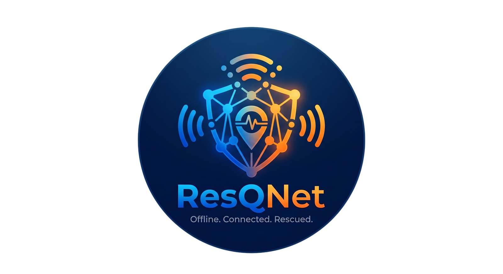
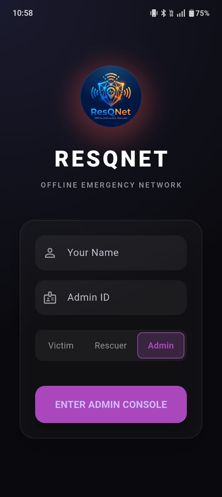
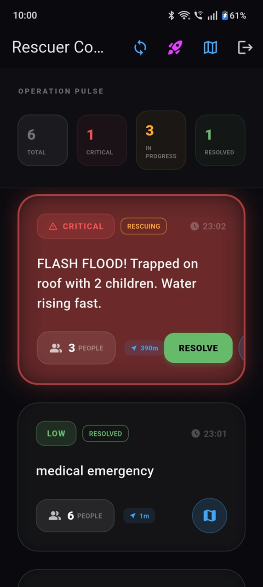
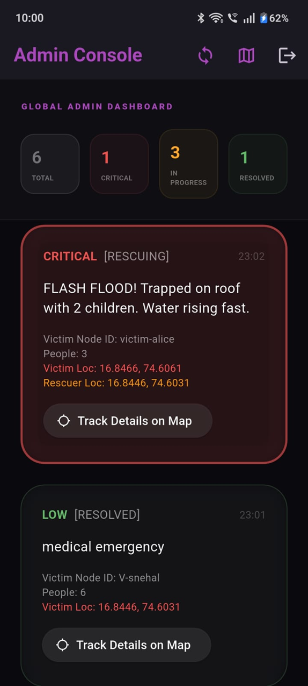
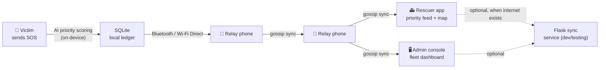

<div align="center">



# ResQNet

**An offline‑first, peer‑to‑peer emergency mesh network with on‑device AI triage.**

Built for the moment cell towers and the internet go down — exactly when disaster victims need help most.

[](https://flutter.dev)
[](https://dart.dev)
[](https://www.python.org)
[](https://scikit-learn.org)
[]()
[](LICENSE)

</div>

---

## The problem

During earthquakes, floods, fires, and cyclones, cellular towers and internet infrastructure are often the **first** thing to fail — right when victims most need to call for help and responders most need situational awareness. Conventional SOS apps that depend on SMS, push notifications, or cloud APIs simply stop working the moment connectivity does.

## What ResQNet does

ResQNet turns a cluster of ordinary smartphones into a **self‑healing, offline mesh network**. Victims broadcast SOS beacons over Bluetooth/Wi‑Fi Direct; nearby phones relay them hop‑by‑hop — with zero cell towers, routers, or internet — until a rescuer or admin device receives them. Every message is triaged in real time by an **on‑device AI model** so the most critical cases surface first, even with no connection to any server.

| Victim (send SOS) | Rescuer (triage feed + map) | Admin (fleet console) |
|---|---|---|
|  |  |  |

## Core capabilities

- **Peer‑to‑peer mesh networking** — built on Google's [Nearby Connections](https://developers.google.com/nearby/connections/overview) `P2P_CLUSTER` strategy, so devices auto‑discover, connect, and relay messages over Bluetooth/Wi‑Fi Direct with no shared network.
- **Store‑and‑forward (gossip) sync** — each phone keeps a local SQLite ledger of SOS and chat messages. When two devices meet, they diff their ledgers and exchange only what's missing, so a message eventually propagates to every reachable node in the mesh.
- **On‑device AI severity scoring, no runtime dependency** — a TF‑IDF + Random Forest text classifier is trained in scikit‑learn and **transpiled directly into pure Dart** (via [m2cgen](https://github.com/BayesWitnesses/m2cgen)). Inference runs instantly on‑device with no model file to load, no GPU, and no network call. Its output is fused with rule‑based factors — injury severity, headcount, disaster type, connectivity state — into a transparent, explainable 0–100 priority score with a human‑readable factor breakdown.
- **Role‑based experience** — *Victim* (SOS beacon with photo, GPS, headcount, injury severity), *Rescuer* (live priority‑sorted feed, map view, custom **Dijkstra shortest‑path** routing to the highest‑priority signal), *Admin* (fleet‑wide console with live stats and resolution tracking).
- **Offline‑capable maps** — `flutter_map` with a disk‑backed tile cache, so maps stay usable after connectivity is lost.
- **Encrypted‑channel mesh chat & media** — 1:1 chat plus photo/audio evidence sharing between victims and rescuers over the same P2P link.
- **One codebase, six platforms** — Android, iOS, Web, Windows, macOS, and Linux from a single Flutter tree, with a platform‑agnostic storage layer (`sqflite` on native, an IndexedDB‑backed store on web).

## How a message travels



No hop in this chain requires an internet connection — the Flask service is only used during development to simulate/test multi‑node sync over a shared network, not to run the mesh in production.

## Tech stack

**App (Flutter/Dart):** `provider`, `google_fonts`, `flutter_map` + `latlong2` + `flutter_map_cache`, `nearby_connections`, `geolocator`, `permission_handler`, `sqflite` / `path_provider`, `image_picker` + `flutter_image_compress`, `record` + `audioplayers`, `dio` + cache interceptors, `uuid`.

**On‑device ML (Python, build‑time):** `scikit-learn` (TF‑IDF vectorizer + Random Forest classifier), `m2cgen` (Python → Dart source transpilation), plus a `TensorFlow`/`TFLite` experiment for an alternative neural classifier.

**Dev/sync tooling (Python):** `Flask` + `flask-cors` — an in‑memory relay used to exercise multi‑device sync during development.

## Repository structure

```
ResQNet/
├── backend/                    # Python: model training + dev sync simulator (not a production server)
│   ├── ai_engine.py             # Trains TF-IDF + RandomForest, transpiles inference straight to Dart
│   ├── model_trainer.py         # TensorFlow/TFLite experiment for a neural SOS classifier
│   ├── mesh_simulator.py        # Flask relay for testing multi-node sync during development
│   └── requirements.txt
├── resqnet/                    # Flutter application (Android · iOS · Web · Windows · macOS · Linux)
│   ├── lib/
│   │   ├── main.dart                    # App shell, login, Victim/Rescuer screens, mesh chat, Dijkstra routing
│   │   ├── admin_mode_screen.dart       # Admin fleet console
│   │   ├── models/                      # SosMessage, ChatMessage data models
│   │   └── services/
│   │       ├── mesh_service.dart        # Nearby Connections P2P networking + gossip sync
│   │       ├── ai_scorer.dart           # Multi-factor AI priority scoring engine
│   │       ├── ml_model.dart            # Auto-generated Dart inference code (output of ai_engine.py)
│   │       ├── database_helper*.dart    # Cross-platform local persistence (native + web)
│   │       └── map_cache_service.dart   # Offline map tile caching
│   └── android/ ios/ web/ windows/ macos/ linux/   # Platform embeddings
└── docs/                        # Forward-looking cloud-scale system design (see below)
```

## Getting started

**Prerequisites:** [Flutter SDK](https://docs.flutter.dev/get-started/install) ≥ 3.x, Python 3.9+, and Android Studio / Xcode if you're targeting mobile.

```bash
# 1. Clone
git clone https://github.com/snehal1931/ResQNet.git
cd ResQNet

# 2. (Optional) Regenerate the on-device ML model
cd backend
pip install -r requirements.txt
python ai_engine.py          # writes resqnet/lib/services/ml_model.dart

# 3. Run the app
cd ../resqnet
flutter pub get
flutter run
```

To exercise multi‑device sync during development without relying on Bluetooth range, start the local relay in another terminal:

```bash
cd backend
python mesh_simulator.py     # http://localhost:5000
```

> **Note:** `nearby_connections` requires physical Android/iOS hardware — mesh discovery is a no‑op on emulators, web, and desktop builds, so the UI remains fully explorable everywhere while real P2P transport is exercised on device.

## Design decisions worth highlighting

- **Why transpile ML to Dart instead of shipping a `.tflite` model?** For a distress‑text classifier this small, avoiding the TFLite interpreter entirely removes a native dependency, a model‑loading step, and inference latency — the classifier is just Dart code that runs as fast as any other function call, which matters when a phone may be running on a dying battery in the field.
- **Why gossip/epidemic sync instead of a central server?** A disaster mesh has no fixed topology — nodes join, leave, and roam. Diff‑and‑exchange sync means any two devices that happen to be in range converge automatically, without requiring a specific node to be reachable.
- **Why Dijkstra for rescuer routing?** Rescuers need the actual shortest path across the live graph of relay nodes and known obstacles, not just a straight-line distance — a small, auditable algorithm was preferable to a black-box routing call that requires connectivity.

## Roadmap: `docs/`

The `docs/` folder contains an in‑depth system‑design exploration for evolving ResQNet from this offline‑first MVP into a cloud‑backed, internet‑connected platform at scale — event‑driven microservices, a multimodal (text + image) BERT classifier, geo‑clustering for incident hotspots, and multi‑region deployment. **These are design documents, not code that ships in this repository** — they're included to show the intended production architecture and the tradeoffs behind it.

## Demo walkthroughs

- 🧍 [Victim flow](https://drive.google.com/file/d/1Necn4G12tB0xgLeSeRA-4ImHVTDYhjV6/view?usp=sharing)
- 🚑 [Rescuer flow](https://drive.google.com/file/d/1h2_Ff9XqdPGt_Cnm0rkenxwxiwYAdcLZ/view)
- 🖥️ [Admin console flow](https://drive.google.com/file/d/1EjUMtOOi_hpdkyWFYWaHzYgFbFqq0hAH/view)

## Future scope

- [ ] Ensemble the trained TFLite neural classifier alongside the Random Forest model
- [ ] Background SOS re‑broadcast and periodic re‑advertising to widen mesh reach
- [ ] Push notifications and local alerting when a device briefly regains connectivity
- [ ] Multi‑language support for disaster alerts and UI

## Author

**Snehal Patil** — [GitHub](https://github.com/snehal1931)

## License

Released under the [MIT License](LICENSE).

---

<div align="center">If this project is useful or interesting to you, consider giving it a ⭐</div>
